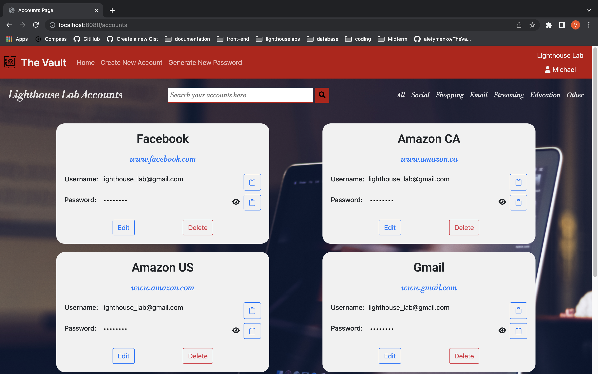

# The Vault Password Keeper Midterm Project

## Project Description
Created by Joe Tang, Artem Iefymenko and Michael Buffone.

The Vault stores passwords for organizations which each user for that organization can have access to the account using the organizations passwords.

The app will let you generate a password using criteria in the app. The user can copy the password and place it into the desired website to access.

## Features
* Able to generate a random password based on criteria
* Seperate Accounts by categories
* Search accounts
* Masked password
* Copy Password to clipboard

## Getting Started

1. Create the `.env` by using `.env.example` as a reference: `cp .env.example .env`
2. Update the .env file with your correct local information 
  - username: `labber` 
  - password: `labber` 
  - database: `midterm`
3. Install dependencies: `npm i`
4. Fix to binaries for sass: `npm rebuild node-sass`
5. Reset database: `npm run db:reset`
  - Check the db folder to see what gets created and seeded in the SDB
7. Run the server: `npm run local`
  - Note: nodemon is used, so you should not have to restart your server
8. Visit `http://localhost:8080/` to visit index page

9. For demo purpose we do not have a login or register. So to loging to a existing user `http://localhost:8080/login/1` for example.

## Dependencies

- Node 10.x or above
- NPM 5.x or above
- PG 6.x
- Cookie-Sessions 1.4.x or above

## Screenshots

Logged In Page

Edit Page

Generate Password Page

